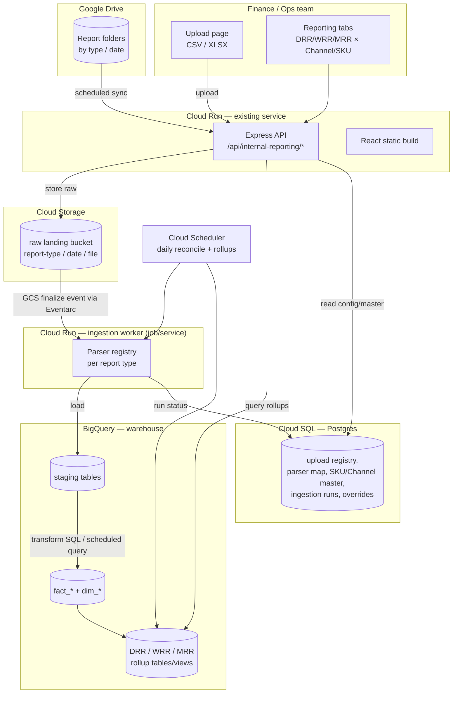

# Internal Reporting Platform — System Design

> Status: **Design proposal (no code)** · Scope: new `/internal-reporting` surface for daily Sales / CX / Operations / Funnel analytics, tracked at Daily / Weekly / Monthly run-rate across Channel, SKU and SKU×Channel dimensions.

---

## 1. Executive summary

We are adding a **new analytics surface** to the existing Heatronics dashboard, reachable only at `/internal-reporting` (not linked from the home page or top nav). It has two sub-pages:

1. **Data Upload** — a Drive-backed drop zone where the team uploads daily reports (CSV / XLSX). Parsing logic differs per report type. *Built as an empty scaffold first.*
2. **Reporting** — tabbed dashboards driven by the **latest** uploaded data:
   - **Sales** (Sales, Cancellations, Refunds)
   - **CX** (CSAT, Reviews, Ratings)
   - **Operations** (RTO, Courier Performance, Cost)
   - **Funnel** (product page views, landing page, add-to-cart, checkout, …)

Every metric is trackable at three **time granularities** — **DRR** (Daily), **WRR** (Weekly), **MRR** (Monthly) run-rate — and sliced by three **dimensions** — **Channel**, **SKU**, and **SKU × Channel**.

This is fundamentally an **ingest → normalize → warehouse → serve** problem. The existing app is a client-side finance MIS tool with no database; this feature needs a real data platform behind it. **Recommendation: Google BigQuery as the warehouse, Cloud Storage as the raw landing zone, an event-driven Cloud Run ingestion worker, and Cloud SQL (Postgres) for operational metadata.** Details and the full GCP shopping list are below.

---

## 2. Current-state evaluation

### 2.1 What exists today

| Area | Current implementation | Reusable for this feature? |
|---|---|---|
| **Frontend** | React 19 + Vite + Tailwind + react-router (`client/`) | ✅ Yes — add routes + tab UI |
| **Routing / nav** | `client/src/App.tsx` routes; nav from `navItems[]` in `MainLayout.tsx` | ✅ Add `/internal-reporting/*`, keep it out of `navItems` |
| **Backend** | Express + TS, ESM (`server/`), routes under `/api/*` | ✅ Add `/api/internal-reporting/*` |
| **Google Drive** | `server/src/services/googleDrive.ts` — readonly ADC/service-account, folder scan, file download as base64 | ✅ Strong starting point for the Drive integration |
| **AI classification** | `server/src/services/geminiClassifier.ts` — rules + Jaccard similarity + Gemini | ⚠️ Optional — could auto-map SKUs / normalize channel names |
| **Excel/PDF parsing** | Client-side (`xlsx`, `pdfjs-dist`) in `client/src/utils/` | ⚠️ Move to **server-side** for automated ingestion |
| **Persistence** | In-memory `Map` (`misDataStore`), `localStorage`, one shared public Google Sheet | ❌ Not adequate — no real DB/DW |
| **Deploy** | Docker → Cloud Run (europe-west1) via Cloud Build + GCR | ✅ Extend; add an ingestion service/job |
| **Auth** | None; Cloud Run `--allow-unauthenticated` | ❌ Must address before real business data lands |

### 2.2 Capability gaps to close

1. **No durable data store.** Data lives in the browser and a public Sheet. Daily multi-report analytics needs a warehouse + a metadata DB.
2. **Parsing is client-side and manual.** Automated daily ingestion needs server-side, per-report parsers.
3. **No ingestion orchestration.** No landing zone, no trigger, no idempotency, no "latest snapshot" logic.
4. **No dimensional model.** Nothing today expresses Channel / SKU / SKU×Channel × Day/Week/Month rollups.
5. **No real access control.** A hidden route is *obscurity*, not security. Business data (revenue, CSAT, cost) warrants authenticated access.

---

## 3. Product surface (functional shape)

```
/internal-reporting                      (hidden shell; NOT in navItems)
├── /upload                              Data Upload — empty scaffold in v1
│      └── (later) drop zone + Drive sync + per-report parser status
└── /reports                             Reporting — tabbed
       ├── Sales      → Sales · Cancellations · Refunds
       ├── CX         → CSAT · Reviews · Ratings
       ├── Operations → RTO · Courier Performance · Cost
       └── Funnel     → Product-page · Landing-page · Add-to-cart · Checkout · …
```

**Global controls present on every reporting tab:**
- **Granularity toggle:** DRR (Daily) · WRR (Weekly) · MRR (Monthly).
- **Dimension selector:** Channel · SKU · SKU × Channel.
- **Date range** picker (defaults to trailing window, e.g. last 30/13w/12m).
- **"Data as of"** timestamp — every view reflects the **latest** ingested data for the selected period.

---

## 4. Recommended architecture



**Flow in words:**
1. A user drops files on the **Upload** page (or files land in a **Drive** folder that we sync on a schedule).
2. The API writes the raw file to a **GCS landing bucket**, partitioned by `report_type/date/`.
3. A **GCS finalize event** (Eventarc) wakes the **ingestion worker**, which selects the correct **parser** for that report type, normalizes rows to a canonical schema, and loads them into **BigQuery staging**.
4. **Scheduled SQL** (or dbt) transforms staging → **fact/dim** tables → **DRR/WRR/MRR rollup** tables.
5. The **Reporting** tabs query the rollups through the API. Ingestion status and masters live in **Cloud SQL**.

### Why this shape
- **Event-driven ingestion** gives near-real-time "latest data" without polling; a **daily Cloud Scheduler** job reconciles anything missed and refreshes rollups.
- **Raw landing zone in GCS** makes every load **replayable** and **idempotent** (re-parse a bad file without re-uploading).
- **Server-side parsing** replaces today's browser parsing so ingestion is automated and consistent.

---

## 5. Data store decision — DB vs DW

**Recommendation: use both, for different jobs.**

### 5.1 Analytics store → **Google BigQuery** (the data warehouse)
- Columnar, serverless, pay-per-query — ideal for the **fact tables + DRR/WRR/MRR rollups + dimensional slicing** this feature is entirely about.
- Trivial to compute weekly/monthly run-rates and Channel / SKU / SKU×Channel aggregates in SQL.
- Scheduled Queries + Materialized Views handle rollups with no extra infrastructure.
- Native at daily-append volumes; effectively no capacity planning.

### 5.2 Operational metadata store → **Cloud SQL for PostgreSQL**
Holds small, transactional, frequently-updated state that does **not** belong in a columnar warehouse:
- Upload registry (file name, type, hash, status, "is latest").
- Report-type → parser mapping and parser config.
- **SKU master** and **Channel master** (canonical names, aliases, groupings).
- Ingestion run log (success/failure, row counts, errors).
- Manual overrides / mappings the team edits in the UI.

> **Lower-ops alternative:** replace Cloud SQL with **Firestore** if you'd rather not manage a database instance. Trade-off: no SQL joins on metadata, but zero server maintenance. For a small internal tool, Firestore is a legitimate choice; I lead with Cloud SQL because the SKU/Channel masters and overrides are naturally relational.

**Not recommended as the primary analytics store:** Google Sheets (current approach) — no concurrency, no query engine, breaks past a few thousand rows, no access control.

---

## 6. Data model

### 6.1 Grain & shape (star schema in BigQuery)

Base fact grain: **one row per (date, channel, sku, metric-context)** per report domain.

**Dimensions**
- `dim_date` — date, iso_week, month, quarter, fiscal period.
- `dim_channel` — channel_id, name, aliases, group (D2C / Amazon / Blinkit / Offline …).
- `dim_sku` — sku_id, title, category, FG mapping (reuse `client/src/data/skuToFgMapping.ts` / `fgMaster.ts`).
- `dim_sku_channel` — resolved via `(sku, channel)` composite; no separate table needed unless channel-specific SKU attributes exist.

**Facts (daily grain)**
| Fact table | Metrics | Source report(s) |
|---|---|---|
| `fact_sales` | units, gross_sales, net_sales, orders | Sales register / channel exports |
| `fact_cancellations` | cancelled_orders, cancelled_units, cancelled_value | Order/cancellation exports |
| `fact_refunds` | refund_count, refund_value | Refund/returns exports |
| `fact_cx` | csat_score, review_count, avg_rating, nps? | CSAT / reviews / ratings exports |
| `fact_ops` | rto_orders, rto_value, courier_sla_hit, delivery_cost | Courier / logistics exports |
| `fact_funnel` | product_views, landing_views, add_to_cart, checkouts, conversions | Web/GA / channel funnel exports |

### 6.2 Time granularity (DRR / WRR / MRR)
Store facts at **daily** grain; derive weekly/monthly with rollup tables or views:
- `rollup_daily` (= facts), `rollup_weekly` (ISO week), `rollup_monthly`.
- Each rollup exists per dimension slice: by **Channel**, by **SKU**, by **SKU × Channel**, and total.
- "Run rate" = the metric summed/averaged for the period (and, where useful, annualized). Define per metric (sums for sales/refunds; averages for CSAT/rating; ratios for RTO% and conversion).

### 6.3 "Latest data" semantics
- Each raw load is tagged with `ingested_at` and `source_file_id`.
- For a given (report_type, business_date), the **latest ingestion wins** (upsert/merge on natural key), so re-uploading a corrected file overwrites cleanly.
- Rollups read only the current version → the UI always shows the freshest numbers with a visible "data as of" stamp.

---

## 7. Ingestion pipeline & per-report parsers

The core hard part is *"parsing logic varies from file to file."* Design for it explicitly:

- **Parser registry:** each `report_type` maps to a parser module with a declared **input schema** (expected columns/sheet), a **normalizer** (→ canonical rows), and **validation** (required fields, types, row-count sanity).
- **Detection:** infer `report_type` from filename convention and/or header signature (extends the existing filename-parsing approach in `googleDrive.ts`).
- **Canonical output:** every parser emits rows in a shared shape `{ business_date, channel, sku, metric_fields…, source_file, ingested_at }` so downstream SQL is uniform.
- **Idempotency:** natural key per report → re-runs merge, never duplicate.
- **Quarantine:** unparseable/failed files are flagged in the registry with the error, surfaced on the Upload page, and do **not** corrupt the warehouse.
- **CSV & XLSX:** handle both; XLSX may have multiple sheets — parser declares which sheet(s) it reads.

> The **Upload page ships empty in v1** (scaffold + route only). The parser registry and Drive sync are v2+. This lets the Reporting UI be built and demoed against seed/manual data first.

---

## 8. What we need from Google Cloud

APIs to enable and resources to provision (project already runs on GCP / Cloud Run):

| # | GCP service | Purpose | Notes / IAM |
|---|---|---|---|
| 1 | **BigQuery** | Warehouse: staging, facts, dims, rollups | Enable `bigquery.googleapis.com`; dataset e.g. `internal_reporting`; SA role `roles/bigquery.dataEditor` + `jobUser` |
| 2 | **Cloud Storage** | Raw landing bucket (replayable ingestion) | Bucket `heatronics-reporting-raw`; SA `roles/storage.objectAdmin` on it |
| 3 | **Cloud Run (2nd service or Job)** | Ingestion worker (parse → load) | Separate from the web service for isolation/scaling |
| 4 | **Eventarc** | GCS `object.finalized` → ingestion worker | `eventarc.googleapis.com`; trigger SA |
| 5 | **Cloud Scheduler** | Daily Drive reconcile + rollup refresh | `cloudscheduler.googleapis.com` |
| 6 | **Cloud SQL (PostgreSQL)** *(or Firestore)* | Operational metadata / masters / overrides | `sqladmin.googleapis.com`; SA `roles/cloudsql.client`; connect via connector |
| 7 | **Secret Manager** | DB creds, service-account keys, Gemini key | `secretmanager.googleapis.com`; already implied by current setup |
| 8 | **Drive API** | Read report folders (already used) | Already enabled; ensure SA has access to the shared Drive/folder |
| 9 | **Artifact Registry** | Container images (migrate off legacy GCR) | `artifactregistry.googleapis.com` |
| 10 | **IAM Service Accounts** | Least-privilege identities for web + ingestion | Distinct SAs per service; avoid broad roles |
| 11 | **Identity-Aware Proxy (IAP)** *(or Firebase Auth)* | **Real auth** in front of the internal surface | Restrict to company Google accounts / domain |
| 12 | **Cloud Logging & Monitoring** | Ingestion observability, alerts on failures | Alert on failed loads, stale data, freshness SLO |
| 13 | **Memorystore (Redis)** *(optional)* | Cache hot rollup queries if BQ latency/cost matters | Only if needed after measuring |
| 14 | **Looker Studio** *(optional)* | Free BI layer directly on BigQuery for ad-hoc | Complements, doesn't replace, the custom tabs |

**Minimum viable set to start (v1–v2):** BigQuery, Cloud Storage, one extra Cloud Run service, Eventarc, Cloud Scheduler, Cloud SQL (or Firestore), Secret Manager, plus IAP for auth. Items 9/10/12 are hygiene you'll want regardless; 13/14 are optional.

---

## 9. Functional requirements

**Upload (v1 = scaffold; behavior below is the target state)**
- FR-1 Users can upload one or more CSV/XLSX files from the Upload page.
- FR-2 Files also sync from a designated Google Drive folder on a daily schedule.
- FR-3 The system detects report type per file and routes to the correct parser.
- FR-4 Parsed data is normalized to the canonical schema and loaded to the warehouse.
- FR-5 Each upload shows status: received → parsed → loaded → (or) failed, with the error on failure.
- FR-6 Re-uploading a corrected file for the same report/date overwrites prior data (latest wins).
- FR-7 Failed/quarantined files never corrupt reporting data and are listed for retry.

**Reporting**
- FR-8 Four tabs: Sales (Sales/Cancellations/Refunds), CX (CSAT/Reviews/Ratings), Operations (RTO/Courier/Cost), Funnel (page/landing/ATC/checkout…).
- FR-9 Every tab supports granularity DRR / WRR / MRR.
- FR-10 Every tab supports dimension Channel / SKU / SKU×Channel.
- FR-11 Every tab supports a date-range selection with sensible trailing defaults.
- FR-12 Each view reflects the **latest** ingested data and shows a "data as of" timestamp.
- FR-13 Views expose period-over-period comparison (e.g. this week vs last week) where meaningful.
- FR-14 Users can export the current view (CSV / image) — reuse existing export utilities.

**Platform**
- FR-15 SKU master and Channel master are editable so raw aliases map to canonical entities.
- FR-16 `/internal-reporting/*` is not present in `navItems` and not linked from Home.
- FR-17 The four report domains are independently extensible (add a metric/report without schema churn elsewhere).

## 10. Non-functional requirements

- NFR-1 **Security/Access:** the surface requires authentication (IAP or Firebase Auth, company-domain restricted). The hidden route is convenience, **not** the access control. No public unauthenticated access to business data.
- NFR-2 **Data freshness:** newly uploaded data visible in reporting within ~5 min (event-driven), and guaranteed by the daily reconcile.
- NFR-3 **Idempotency & correctness:** re-ingesting the same file is safe; totals never double-count.
- NFR-4 **Query performance:** tab loads < ~2 s on trailing-window queries (pre-materialized rollups; cache if needed).
- NFR-5 **Reliability:** ingestion failures are isolated, logged, alerted, and retryable without data loss.
- NFR-6 **Scalability:** design holds as report types, SKUs and channels grow; daily volumes are small for BigQuery.
- NFR-7 **Cost:** serverless, scale-to-zero where possible; rollups keep per-query BQ cost low; monitor spend.
- NFR-8 **Auditability:** every metric is traceable to a source file + ingestion timestamp (lineage via raw GCS + registry).
- NFR-9 **Maintainability:** parsers are isolated modules with declared schemas + validation; adding a report = adding a parser + a fact mapping.
- NFR-10 **Observability:** dashboards/alerts for load success, data freshness SLO, and parse error rate.
- NFR-11 **Privacy/PII:** if CX exports contain customer PII, restrict columns, avoid storing what isn't needed, keep access least-privilege.
- NFR-12 **Backward compatibility:** the new surface must not disturb the existing finance MIS app (separate routes, dataset, and ingestion service).

---

## 11. Security note on the "hidden" route

Not linking `/internal-reporting` from the nav keeps it out of the way, but the URL is still reachable by anyone who knows it, and the app is currently deployed `--allow-unauthenticated`. Before real Sales/CX/Cost data goes in, put the surface behind **authentication** (recommended: **IAP** in front of Cloud Run restricted to your Google Workspace domain, or Firebase Auth with a domain allowlist). Treat "hidden" as UX, "authenticated" as the actual control.

---

## 12. Phased delivery plan

| Phase | Deliverable | Includes |
|---|---|---|
| **P0** | Foundations | Provision BigQuery dataset, GCS bucket, Cloud SQL (or Firestore), service accounts, secrets; add IAP/auth |
| **P1** | Hidden surface + Reporting UI shell | `/internal-reporting` routes (unlinked), 4 tabs, granularity + dimension controls, wired to **seed data** in BigQuery |
| **P2** | Warehouse model + rollups | Facts/dims, DRR/WRR/MRR rollups, SKU/Channel masters, API query endpoints |
| **P3** | Ingestion — first report | GCS upload path + one parser end-to-end (e.g. Sales), event trigger, registry/status |
| **P4** | Ingestion — remaining reports | Cancellations, Refunds, CX, Ops, Funnel parsers; Drive scheduled sync |
| **P5** | Upload page UX + hardening | Drop zone, status/quarantine views, alerts, freshness SLO, caching if needed |

The **Upload page stays empty until P3** (per the request); Reporting can be built and reviewed against seed data from P1.

---

## 13. Decisions needed from you

1. **Metadata store:** Cloud SQL (Postgres, relational masters) *[recommended]* vs Firestore (zero-ops)?
2. **Auth:** IAP + Google Workspace domain *[recommended]* vs Firebase Auth vs keep it open for now (not advised)?
3. **Ingestion trigger:** event-driven (Eventarc) *[recommended]* vs simple daily batch only?
4. **Report inventory:** the exact list of daily source files per domain, with sample headers, so parsers and the canonical schema can be finalized.
5. **Channel & SKU taxonomy:** the canonical channel list and whether SKU master can be seeded from existing `fgMaster.ts` / `skuToFgMapping.ts`.
6. **"Run rate" definition per metric:** sum vs average vs ratio vs annualized, per metric family.
```
